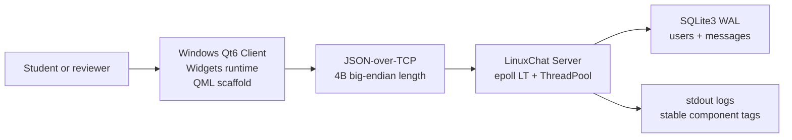
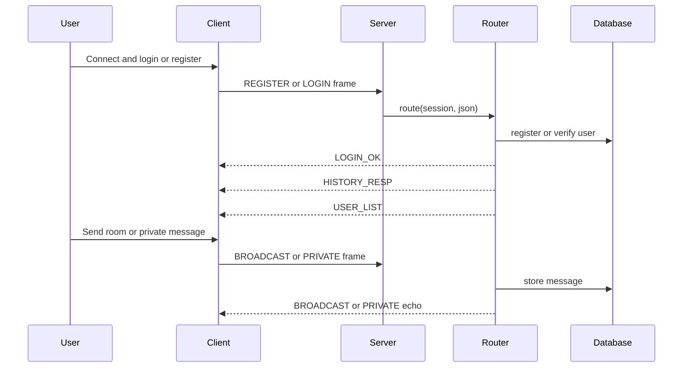
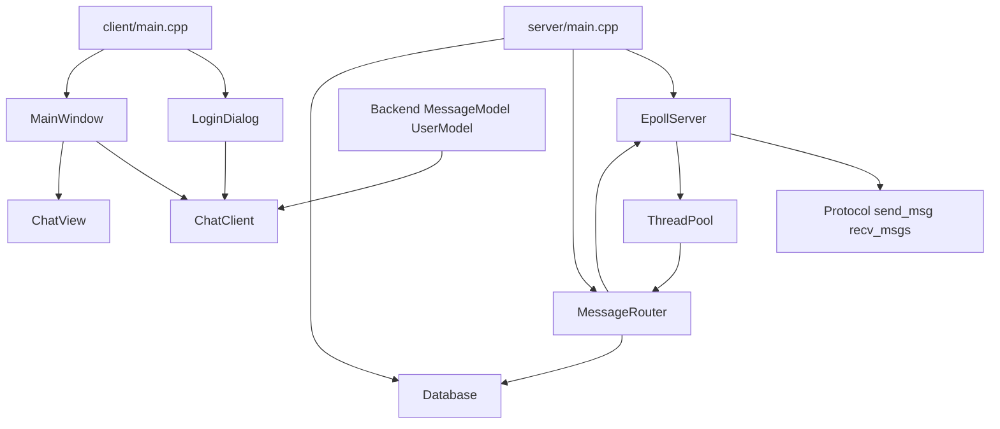
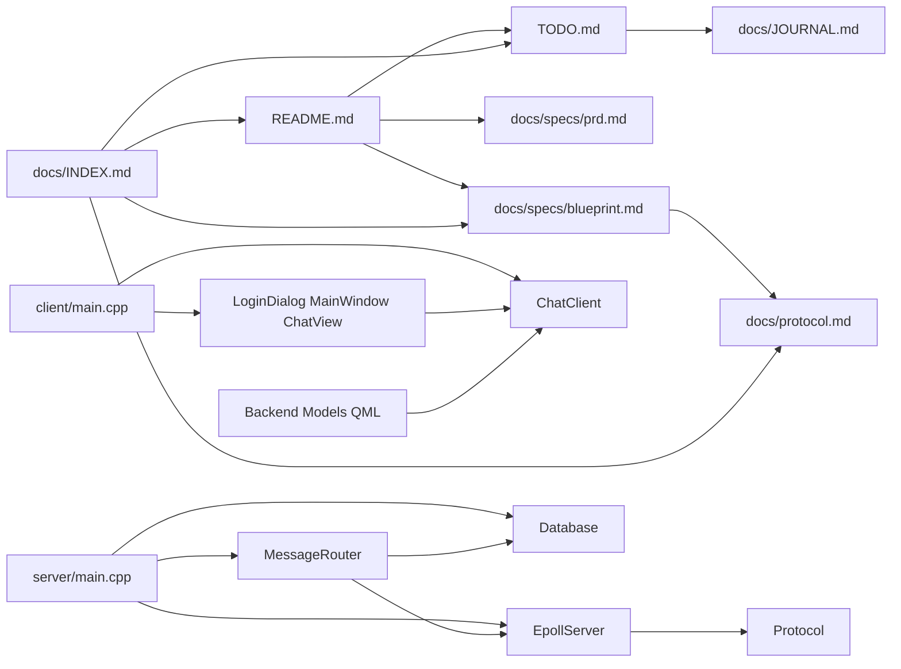

# Context for `LinuxChat`

## Executive Summary

LinuxChat is a C/S instant messaging course project: a Linux C++17 TCP server built on epoll, a thread pool, SQLite, OpenSSL, and nlohmann::json, paired with a Windows Qt6 desktop client. The stable runtime is still Qt Widgets + QSS; a QML/Qt Quick migration scaffold is present but not yet the application entrypoint.

The repository uses Chat-Driven Development (CDD): `README.md` is the runbook entrypoint, `TODO.md` is the execution index, `docs/specs/prd.md` captures product scope, `docs/specs/blueprint.md` captures architecture contracts, and this file is the generated context snapshot.

## Project Snapshot

- **Languages**: C++17, QML, QSS, Markdown, small Python smoke scripts.
- **Frameworks**: Linux epoll, Qt6 Widgets, optional Qt6 Qml/Quick/QuickControls2 scaffold, Google Test.
- **Key Libraries**: SQLite3, OpenSSL EVP SHA-256, nlohmann::json, Qt Network, Qt Svg.
- **Architecture**: Windows desktop client -> JSON-over-TCP frames -> Remote Linux host epoll server -> worker-thread message routing -> SQLite WAL persistence.
- **Protocol**: 4-byte big-endian length prefix + UTF-8 JSON body, 256KB max frame, heartbeat `PING`/`PONG`.
- **Current UI State**: Widgets runtime with Modern Gray Light theme + QML SplitView migration underway.
- **Active Work**: `TODO.md` Step 10, Critical architecture fixes + frontend Phase 2 complete. QSS fully rewritten as Dark Slate + Indigo theme.
- **CDD Mode**: Single `docs/INDEX.md`; no `docs/index/` split is active.

## Diagrams

### System Context

### Login And Messaging Flow

### Component Interaction

## File And API Inventory

### Source

| Path | Role | LOC | Key Tags, Symbols, Names |
| :--- | :--- | --: | :----------------------- |
| `server/main.cpp` | Server process entrypoint, CLI parsing, signal handling, dependency wiring. | 107 | `Config`, `parse_args`, `EpollServer`, `MessageRouter`, `Database` |
| `server/include/epoll_server.h` | Server event-loop contract. | 64 | `EpollServer`, `MessageHandler`, `DisconnectHandler`, heartbeat fd |
| `server/src/epoll_server.cpp` | epoll LT loop, nonblocking accept/read, heartbeat timer, session lifecycle, worker dispatch. | 338 | `run`, `handle_client_event`, `broadcast`, `send_to_fd`, generation guard |
| `server/include/message_router.h` | Message routing API and online-user state. | 61 | `route`, `handle_register`, `handle_login`, `handle_logout`, `handle_private` |
| `server/src/message_router.cpp` | Business handlers for auth, room chat, private chat, history, heartbeat PONG. | 281 | `sha256_hex`, `finish_login`, `broadcast_user_list`, `HISTORY_RESP` |
| `server/include/protocol.h` | JSON frame send/receive contract. | 26 | `send_msg`, `send_error`, `send_ok`, `recv_msgs` |
| `server/src/protocol.cpp` | 4-byte BE framing, send-all retry, receive drain, oversized handling. | 134 | `MAX_FRAME_SIZE`, `EAGAIN`, `EINTR`, `recv_buf` |
| `server/include/database.h` | SQLite persistence API. | 46 | `register_user`, `verify_user`, `store_message`, `get_history` |
| `server/src/database.cpp` | SQLite WAL schema and mutex-protected CRUD. | 162 | `users`, `messages`, prepared statements |
| `server/include/thread_pool.h` | Fixed worker-pool API. | 31 | `ThreadPool`, `enqueue` |
| `server/src/thread_pool.cpp` | Worker lifecycle and condition-variable queue. | 51 | `workers_`, `tasks_`, `stop_` |
| `server/include/client_session.h` | Per-connection mutable session state. | 15 | `fd`, `username`, `recv_buf`, `generation`, `is_authenticated` |
| `server/include/crypto_utils.h` | Test-facing crypto helper declarations. | 30 | SHA-256 helper surface |
| `server/CMakeLists.txt` | Server build target and dependencies. | 33 | `linuxchat_server`, SQLite3, OpenSSL |
| `client/main.cpp` | Client runtime entrypoint. Starts Widgets flow and `--test-chat` bypass. | 101 | `QApplication`, `LoginDialog`, `MainWindow`, `--test-chat` |
| `client/include/chat_client.h` | Qt TCP client protocol surface and signals. | 62 | `ChatClient`, `send_login`, `send_private`, `history_received` |
| `client/src/chat_client.cpp` | QTcpSocket framing, reconnect guard, dispatch, heartbeat reply. | 231 | `connect_to_server`, `process_frames`, `dispatch_message`, `PONG` |
| `client/include/login_dialog.h` | Login/register dialog contract. | 58 | `LoginDialog`, login timeout |
| `client/src/login_dialog.cpp` | Login/register UI, connection flow, app-layer timeout. | 288 | `on_connect_clicked`, `on_login_ok`, `set_loading` |
| `client/include/main_window.h` | Main chat window contract. | 84 | `MainWindow`, `returnToLoginRequested`, test mode |
| `client/src/main_window.cpp` | Sidebar, tabs, room/private routing, custom painting, test data. | 440 | `populateTestData`, `on_private_received`, `update_tab_badge` |
| `client/include/chat_view.h` | Chat panel widget API. | 50 | `append_message`, `load_history`, `send_requested` |
| `client/src/chat_view.cpp` | Message bubbles, input area, history render, test data. | 232 | `append_system_message`, `populateTestData` |
| `client/include/font_manager.h` | Custom font loader API. | 23 | `FontManager` |
| `client/src/font_manager.cpp` | Resource font loading. | 62 | LXGW WenKai, Newsreader |
| `client/include/backend.h` | QML facade around `ChatClient`. | 38 | `Q_PROPERTY`, `Q_INVOKABLE`, `connectionStatus` |
| `client/src/backend.cpp` | QML Backend implementation skeleton. | 78 | `connectToServer`, `login`, `sendMessage`, signals |
| `client/include/message_model.h` | QML message list model. | 35 | `QAbstractListModel`, roles, `addMessage` |
| `client/src/message_model.cpp` | Message model role/data implementation. | 47 | `SenderRole`, `ContentRole`, `IsSelfRole` |
| `client/include/user_model.h` | QML online-user model. | 28 | `Q_PROPERTY count`, `setUsers` |
| `client/src/user_model.cpp` | User model role/data implementation. | 38 | `UsernameRole`, `countChanged` |
| `client/qml/main.qml` | Minimal QML pipeline placeholder. | 30 | `ApplicationWindow`, scaffold status |
| `client/resources/style.qss` | Current Widgets theme stylesheet. | 577 | Dark Slate + Indigo theme, objectName selectors |
| `client/resources/resources.qrc` | Qt resource manifest. | 10 | fonts, SVGs, `style.qss` |
| `client/CMakeLists.txt` | Client build target with optional QML module. | 67 | `HAS_QML`, `qt_add_qml_module`, Qt Widgets/Network/Svg |

No source file currently exceeds the 760 LOC refactor-candidate threshold. `client/resources/style.qss` and `client/src/main_window.cpp` are the largest maintainability watch points.

### Tests

| Path | Role | LOC | Key Tags, Symbols, Names |
| :--- | :--- | --: | :----------------------- |
| `tests/test_protocol.cpp` | Frame encode/decode, drain, invalid JSON, oversized, Unicode, helper messages. | 322 | 19 protocol tests |
| `tests/test_database.cpp` | SQLite registration, verification, history, concurrency behavior. | 197 | `DatabaseTest`, temp DB |
| `tests/test_message_handler.cpp` | Legacy handler-format tests and message JSON shape checks. | 220 | `PipeSession`, `LOGIN_OK`, `HISTORY_RESP` |
| `tests/test_message_router.cpp` | MessageRouter auth, routing, validation, persistence, online behavior. | 344 | `MessageRouterTest`, `REGISTER`, `LOGIN`, `PRIVATE` |
| `tests/test_crypto.cpp` | SHA-256 helper compatibility. | 53 | EVP hash output |
| `tests/test_thread_pool.cpp` | Worker execution and queue behavior. | 154 | `ThreadPool` |
| `tests/CMakeLists.txt` | Google Test build targets. | 111 | `test_protocol`, `test_router`, `ctest` |
| `test_connection.py` | Manual TCP connection smoke script. | 35 | localhost/default port probe |
| `test_protocol.py` | Python protocol smoke script. | 64 | frame construction |

### Documentation And Other

| Path | Role | LOC | Key Tags, Symbols, Names |
| :--- | :--- | --: | :----------------------- |
| `README.md` | Human runbook and project overview. | 141 | build commands, feature summary, docs links |
| `TODO.md` | CDD execution index and active QML migration step. | 151 | Step 00-08, UAT, Future Steps |
| `AGENTS.md` | Agent operating contract for this repo. | 76 | CDD rules, DoD, output format |
| `CLAUDE.md` | Claude-oriented project guidance. | 77 | build/test commands, high-care files, current state |
| `docs/specs/prd.md` | Product scope and acceptance criteria. | 71 | goals, non-goals, known issues |
| `docs/specs/blueprint.md` | Architecture and invariants contract. | 166 | components, interfaces, runbook |
| `docs/protocol.md` | Wire protocol specification. | 162 | message types, errors, heartbeat |
| `docs/JOURNAL.md` | Single-file live development journal. | 43 | latest high-signal implementation notes |
| `docs/prompts/PROMPT-INDEX.md` | Canonical INDEX generation prompt. | 165 | single vs split mode rules |
| `docs/designs/2026-06-17-qss-chat-redesign.md` | Historical UI design note. | 553 | QSS redesign, theme rationale |
| `docs/superpowers/specs/2026-06-16-bottle-messenger-ui-design.md` | Earlier superpowers UI spec. | 146 | visual direction reference |
| `docs/superpowers/plans/2026-06-16-bottle-messenger-ui-redesign.md` | Large historical implementation plan. | 1060 | large-reference, not current execution index |
| `docs/legacy/*` | Pre-CDD document backups. | 325 | legacy README, TODO, CONTRACT, ARCHITECTURE |
| `ARCHITECTURE.md` | Root architecture summary kept for compatibility. | 166 | current-ish, secondary to blueprint |
| `CONTRACT.md` | Root module contract kept for compatibility. | 115 | secondary to blueprint |
| `PRESENTATION.md` | Course presentation material. | 202 | demo/defense content |
| `client/resources/images/*` | SVG visual assets. | n/a | globe, wisteria pattern |
| `client/resources/fonts/*` | Embedded fonts. | n/a | LXGW WenKai, Newsreader |
| `server/third_party/nlohmann/json.hpp` | Vendored JSON library. | n/a | intentionally excluded from LOC |

## Dependency Map

## Glossary

- **CDD**: Chat-Driven Development; the repo workflow that keeps TODO, specs, journal, and context index aligned.
- **Frame**: One protocol packet: 4-byte big-endian payload length followed by one JSON body.
- **LT epoll**: Level-triggered epoll mode; unread data stays ready and must be drained safely.
- **Generation token**: Per-session counter used to prevent fd-reuse worker tasks from writing to a new client.
- **Room history**: Broadcast messages stored with `to="__room__"`.
- **Widgets runtime**: The current Qt Widgets application path started by `client/main.cpp`.
- **QML scaffold**: Optional build-time QML module and C++ facade/models that are not yet the runtime UI.
- **Dark Slate + Indigo theme**: Current QSS visual direction in `client/resources/style.qss`.

## Recent Documentation

- [架构全面审计报告](docs/archive/architecture-audit-2026-06-19.md) — 6智能体审计，3 CRITICAL + 8 HIGH + 7 MEDIUM 问题
- [第三轮 recv n=0 分析](docs/archive/third-round-analysis-2026-06-19.md) — 三轮修复的根因分析和智能体技能报告
- [P0 修复审查报告](docs/archive/p0-review-2026-06-19.md) — 4智能体并行审查，3个CRITICAL已修复，4个HIGH待修复
- [前端现代化 Step 09](TODO.md#step-09--前端现代化-phase-1--done-2026-06-19) — 多智能体头脑风暴，Option B Dark Slate + Indigo 推荐
- [Critical 修复 + QSS 重写 Step 10](TODO.md#step-10--critical-架构修复--qss-全面重写--done-2026-06-19) — comprehensive-review 后修复 3 Critical + QSS 全面重写
- [安全加固 + P0 修复 Step 12](TODO.md#step-12--安全加固--p0-修复--done-2026-06-19) — 第二次 comprehensive-review 后修复 2 P0 + 3 HIGH + 2 P1
- [Open Design 浅色主题 Step 13](TODO.md#step-13--open-design-浅色主题--designdmd--done-2026-06-19) — Modern Gray 浅色主题 + LXGW WenKai 字体

## Last Generated

- **Lines of Code (App/Tests)**: App text LOC 3,958; tests LOC 1,401; vendored JSON and binary assets excluded.
- **Scanned Text Files**: 60 source, test, doc, and script files.
- **Last Commit Msg**: `feat: Dark Slate + Indigo theme design`
- **Timestamp**: 2026-06-19 Asia/Taipei
- **LLM Model**: Claude Fable 5
- **Grade**: 11.7/12
